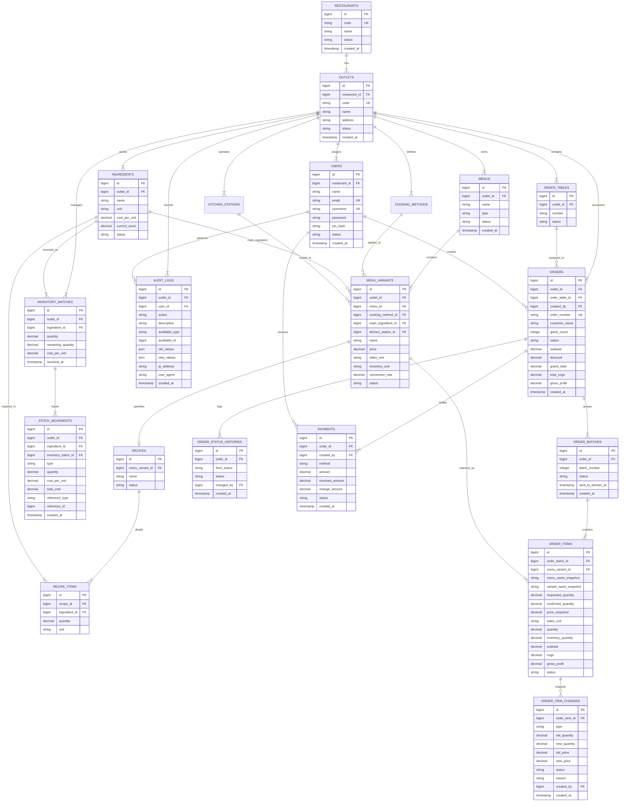

# Entity Relationship Diagram (ERD)

Dokumen ini mendeskripsikan struktur relasi database PostgreSQL untuk sistem manajemen restoran seafood.

```mermaid
erDiagram
    RESTAURANTS ||--|{ OUTLETS : has
    OUTLETS ||--|{ USERS : assigns
    OUTLETS ||--|{ MENUS : owns
    OUTLETS ||--|{ INGREDIENTS : stocks
    OUTLETS ||--|{ KITCHEN_STATIONS : operates
    OUTLETS ||--|{ COOKING_METHODS : defines
    OUTLETS ||--|{ ORDER_TABLES : contains
    OUTLETS ||--|{ ORDERS : processes
    OUTLETS ||--|{ INVENTORY_BATCHES : manages
    OUTLETS ||--|{ AUDIT_LOGS : records

    MENUS ||--|{ MENU_VARIANTS : contains
    COOKING_METHODS ||--o{ MENU_VARIANTS : applies_to
    INGREDIENTS ||--o{ MENU_VARIANTS : main_ingredient
    KITCHEN_STATIONS ||--o{ MENU_VARIANTS : routed_to

    MENU_VARIANTS ||--o| RECIPES : specifies
    RECIPES ||--|{ RECIPE_ITEMS : details
    INGREDIENTS ||--|{ RECIPE_ITEMS : required_in

    INGREDIENTS ||--|{ INVENTORY_BATCHES : received_as
    INVENTORY_BATCHES ||--|{ STOCK_MOVEMENTS : tracks

    ORDER_TABLES ||--o{ ORDERS : assigned_to
    ORDERS ||--|{ ORDER_BATCHES : groups
    ORDER_BATCHES ||--|{ ORDER_ITEMS : contains
    MENU_VARIANTS ||--|{ ORDER_ITEMS : selected_as
    ORDER_ITEMS ||--o{ ORDER_ITEM_CHANGES : requests
    ORDERS ||--|{ ORDER_STATUS_HISTORIES : logs
    ORDERS ||--|{ PAYMENTS : settles

    USERS ||--o{ ORDERS : creates
    USERS ||--o{ PAYMENTS : receives
    USERS ||--o{ AUDIT_LOGS : performs

    RESTAURANTS {
        bigint id PK
        string code UK
        string name
        string status
        timestamp created_at
    }

    OUTLETS {
        bigint id PK
        bigint restaurant_id FK
        string code UK
        string name
        string address
        string status
        timestamp created_at
    }

    USERS {
        bigint id PK
        bigint restaurant_id FK
        string name
        string email UK
        string username UK
        string password
        string pin_hash
        string status
        timestamp created_at
    }

    MENUS {
        bigint id PK
        bigint outlet_id FK
        string name
        string type
        string status
        timestamp created_at
    }

    MENU_VARIANTS {
        bigint id PK
        bigint outlet_id FK
        bigint menu_id FK
        bigint cooking_method_id FK
        bigint main_ingredient_id FK
        bigint kitchen_station_id FK
        string name
        decimal price
        string sales_unit
        string inventory_unit
        decimal conversion_rate
        string status
    }

    RECIPES {
        bigint id PK
        bigint menu_variant_id FK
        string name
        string status
    }

    RECIPE_ITEMS {
        bigint id PK
        bigint recipe_id FK
        bigint ingredient_id FK
        decimal quantity
        string unit
    }

    INGREDIENTS {
        bigint id PK
        bigint outlet_id FK
        string name
        string unit
        decimal cost_per_unit
        decimal current_stock
        string status
    }

    INVENTORY_BATCHES {
        bigint id PK
        bigint outlet_id FK
        bigint ingredient_id FK
        decimal quantity
        decimal remaining_quantity
        decimal cost_per_unit
        timestamp received_at
    }

    STOCK_MOVEMENTS {
        bigint id PK
        bigint outlet_id FK
        bigint ingredient_id FK
        bigint inventory_batch_id FK
        string type
        decimal quantity
        decimal cost_per_unit
        decimal total_cost
        string reference_type
        bigint reference_id
        timestamp created_at
    }

    ORDER_TABLES {
        bigint id PK
        bigint outlet_id FK
        string number
        string status
    }

    ORDERS {
        bigint id PK
        bigint outlet_id FK
        bigint order_table_id FK
        bigint created_by FK
        string order_number UK
        string customer_name
        integer guest_count
        string status
        decimal subtotal
        decimal discount
        decimal grand_total
        decimal total_cogs
        decimal gross_profit
        timestamp created_at
    }

    ORDER_BATCHES {
        bigint id PK
        bigint order_id FK
        integer batch_number
        string status
        timestamp sent_to_kitchen_at
        timestamp created_at
    }

    ORDER_ITEMS {
        bigint id PK
        bigint order_batch_id FK
        bigint menu_variant_id FK
        string menu_name_snapshot
        string variant_name_snapshot
        decimal requested_quantity
        decimal confirmed_quantity
        decimal price_snapshot
        string sales_unit
        decimal quantity
        decimal inventory_quantity
        decimal subtotal
        decimal cogs
        decimal gross_profit
        string status
    }

    ORDER_ITEM_CHANGES {
        bigint id PK
        bigint order_item_id FK
        string type
        decimal old_quantity
        decimal new_quantity
        decimal old_price
        decimal new_price
        string status
        string reason
        bigint created_by FK
        timestamp created_at
    }

    ORDER_STATUS_HISTORIES {
        bigint id PK
        bigint order_id FK
        string from_status
        string status
        bigint changed_by FK
        timestamp created_at
    }

    PAYMENTS {
        bigint id PK
        bigint order_id FK
        bigint created_by FK
        string method
        decimal amount
        decimal received_amount
        decimal change_amount
        string status
        timestamp created_at
    }

    AUDIT_LOGS {
        bigint id PK
        bigint outlet_id FK
        bigint user_id FK
        string action
        string description
        string auditable_type
        bigint auditable_id
        json old_values
        json new_values
        string ip_address
        string user_agent
        timestamp created_at
    }
```

